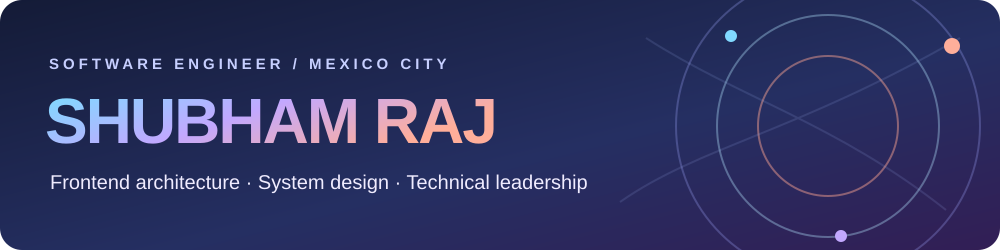

  
  
  

## 👋 Hello, I'm Shubham

I'm a **frontend engineer and Senior Associate Consultant at Infosys**, currently based in **Mexico City**. I have **6+ years of experience** across banking, payments, product engineering, and quality engineering. My work connects the details of a responsive interface to the wider system: reusable architecture, performance, accessibility, code review, and dependable delivery.

At Infosys, I work on **Visa** payment products and previously worked on **Citi** applications. Before that, I built financial interfaces for **Discover Bank** and **Abu Dhabi Bank** through Capgemini. My **M.Tech in Data Engineering from IIT Jodhpur** brings data and machine-learning foundations to that frontend experience.

> **How I work:** make complex products feel clear, build foundations other engineers can reuse, and keep engineering decisions human-reviewed—even when AI helps move faster.

### ⚡ Currently focused on

- 🏗️ **Frontend architecture:** shared libraries, monorepos, application boundaries, and design systems.
- 🚀 **Product performance:** loading, rendering, state management, and responsive interactions.
- 🤝 **Technical leadership:** code reviews, mentoring, cross-functional delivery, and maintainable decisions.
- 🧠 **AI-assisted engineering:** useful exploration and prototyping backed by tests, validation, and human review.

## 🧰 Technologies I work with

**Frontend and UI** 

**Architecture, state, and APIs** 

**Quality and delivery** 

**Data and AI foundations** 

[Explore how these capabilities connect to my work →](https://shubhamraj.dev/stack)

## 💼 Engineering chapters

| Role | What I worked on |
| --- | --- |
| **Senior Associate Consultant · Infosys** Dec 2024–present | **Visa:** shared React/TypeScript foundations and coordinated delivery across payment products. **Citi:** data-rich interfaces, state management, rendering and load performance, technical reviews, and mentoring. |
| **Consultant / Associate Consultant · Capgemini** May 2021–Nov 2024 | **Discover Bank:** reusable React features and cross-browser quality. **Abu Dhabi Bank:** TypeScript, Material UI, form patterns, API integration, testing, and code review. |
| **Solution Engineer · GAMMASTACK** May–Aug 2020 | React and Next.js product interfaces, reusable UI, forms, and API integrations. |
| **Software Developer · NAGRA** Jul 2018–Jul 2019 | JavaScript test automation, regression coverage, and Jenkins delivery checks. |

### 🔎 Explore the work

| Visa | Citi | Discover Bank |
| --- | --- | --- |
| [Shared frontend foundations ↗](https://shubhamraj.dev/work/visa) | [Performance and data-rich UI ↗](https://shubhamraj.dev/work/citi) | [Reusable banking interfaces ↗](https://shubhamraj.dev/work/discover) |

[Abu Dhabi Bank](https://shubhamraj.dev/work/abu-dhabi-bank) · [NAGRA](https://shubhamraj.dev/work/nagra) · [GAMMASTACK](https://shubhamraj.dev/work/gammastack) · [More about my experience](https://shubhamraj.dev/about#experience)

## 🎓 Education

- **Indian Institute of Technology Jodhpur** — M.Tech in Data Engineering, 2026. Coursework includes distributed systems, machine learning, big data management, Python, SQL, and stream analytics.
- **Bhilai Institute of Technology** — B.E. in Computer Engineering, 2018.
- **Microverse** — remote full-stack web development program, 2019–2021.

## 🏅 Certifications and continued learning

**Architecture, developer platforms, and AI**

- [Claude Certified Architect – Foundations](https://www.credly.com/badges/69416d41-096a-4e48-8a5e-4806ef79182f) · Anthropic, 2026.
- GitHub Foundations · Microsoft, 2026.
- Certified Partner Specialist, Gemini Enterprise Agent Development and Deployment · Google, 2026.
- [Building RAG Apps Using MongoDB](https://www.credly.com/badges/36124ea0-d50e-480f-819e-1e7c85859f15) · MongoDB, 2026.
- [Build with Gemini](https://partner.skills.google/public_profiles/bf90cda7-ad61-492d-a4e4-e264c31208de/badges/28040973) · Google, 2026.
- [Introduction to Model Context Protocol](https://verify.skilljar.com/c/27acrdeurjmc), [Claude Code in Action](https://verify.skilljar.com/c/8546yqvw75rf), and [Building with the Claude API](https://verify.skilljar.com/c/jxmhpuuwt7mi) · Anthropic, 2026.

**Frontend, cloud, and quality**

- Salesforce JavaScript Developer I · Salesforce, 2025.
- [AWS Partner: Generative AI Essentials](https://www.credly.com/badges/55b58ce4-f27e-49d1-a484-b6b3e32dfd03) · AWS, 2024.
- [M001: MongoDB Basics](https://university.mongodb.com/course_completion/9ce7c1b1-2c42-4315-9121-cc0b84074ef0) · MongoDB University, 2021.
- Certified Data Scientist and Data Science Foundation · IABAC, 2019.
- ISTQB Foundation Level · ISTQB, 2018.

My [portfolio's education and credentials section](https://shubhamraj.dev/about#education) has the full record, including additional Google Gemini Enterprise, Gemini CLI, Claude, and Microverse learning badges.

## ✨ A project close to this profile

**[shubhamraj.dev](https://shubhamraj.dev/)** is my interactive portfolio: selected work, case studies, engineering capabilities, technical writing, and small experiments in the [Lab](https://shubhamraj.dev/lab). Its [source lives here on GitHub](https://github.com/shubham14p3/react-shubham-21).

## 📈 GitHub activity

  

---

<strong>Let's build something thoughtful.</strong> 
<a href="https://shubhamraj.dev/contact">Contact through my portfolio</a> · <a href="mailto:shubham14p3@gmail.com">Email</a> · <a href="https://www.linkedin.com/in/shubham14p3/">LinkedIn</a>

